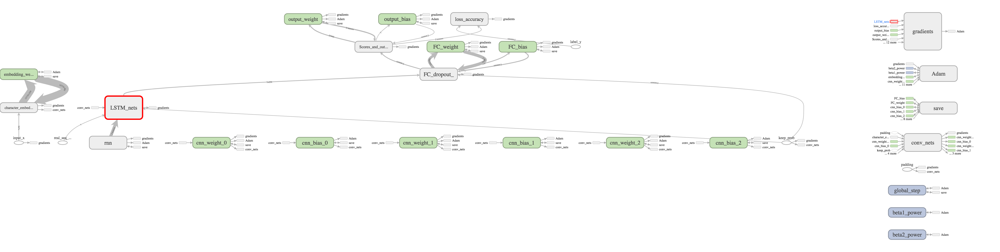
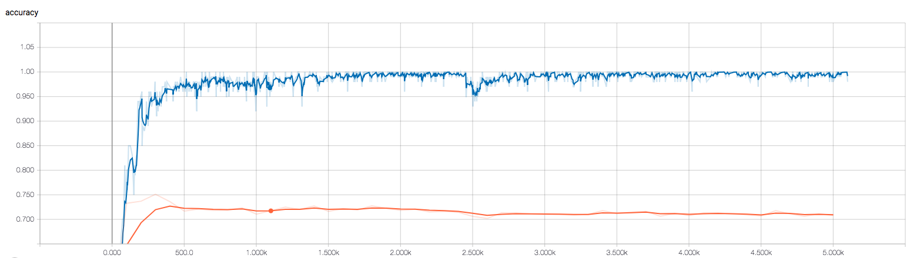
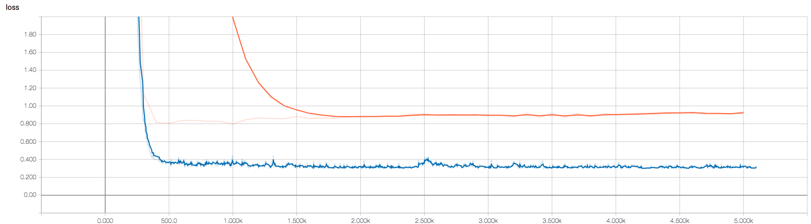

# CNN-LSTM-Text-Classification
Apply CNN-LSTM model on multi-class text classification task.



## Instructions
After setting the model configerations in `train.py`
run the following commands in terminal.

```{bash}
$ python train.py
```

and view the result in tensorboard (you could replace the path after `--logdir` by yours).

```{bash}
$ tensorboard --logdir='1536427044/runs/summaries'
```

## Performance



## Discussion
still faced with the problem of overfitting. I have tried l2 regularization and dropout, cannot see a good improvement. If you guys who view this repo and has alternatives, leave comments here.